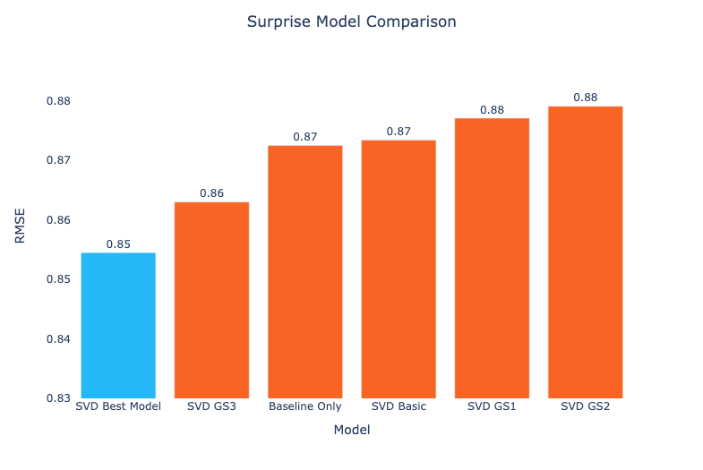

# Movie Recommendation System


**Authors**:

Anat Jacobson
Stephanie Ciaccia

## Overview

Build a model that provides top 5 movie recommendations to a user, based on their ratings of other movies.

The MovieLens dataset is a "classic" recommendation system dataset, that is used in numerous academic papers and machine learning proofs-of-concept. You will need to create the specific details about how the user will provide their ratings of other movies, in addition to formulating a more specific business problem within the general context of "recommending movies".

## Business Problem


## Data

- **Movie Lens** - For the recommendation system, we used data from [Movie Lens]([http://movielens.org]) that was created by 610 users between March 29, 1996 - September 24, 2018. It contains 100836 ratings and 3683 tag applications across 9742 movies. 

Files from the dataset inclue `links.csv`, `movies.csv`, `ratings.csv` and `tags.csv`.

## Methods

To create a personalized recommendation system for our dataset, we will use a method called **user-based collaborative filtering**. This approach is based on the idea that people who have similar tastes or preferences in the past will have similar tastes in the future. This means that the model makes recommendations based on other similar user preferences.

To apply user-based collaborative filtering, the model will identify the movies that the user has rated in the past. It will then find other users who have rated those movies similarly to the target user. Once similar users have been found, the model will use their ratings to predict the target user's rating for movies they have not yet seen.

## Results

Root Mean Square Error (RMSE) score was used as the main metric to determine the accuracy of the predictive model. The RMSE measures the difference btween the actual and prediting ratings. The movie ratings are on a scale of 1-5. 

Our best model was built using Singular Value Decomposition (SVD) and achieved an RMSE of 0.85.



## Conclusions


## Next Steps


## For More Information

See the full analysis in the [Jupyter Notebook](add git link here)

## Repository Structure

```
├── data
├── images
├── .gitignore
├── movie_recommendation_system.ipynb
├── movie_recommendation_system.pdf
├── LICENSE
└── README.md
