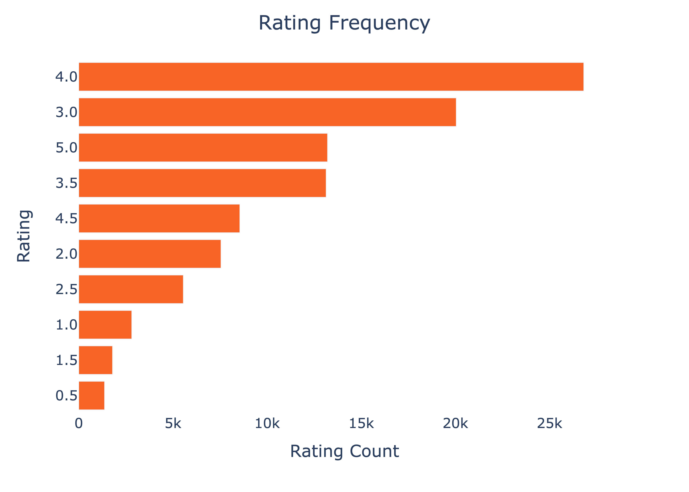
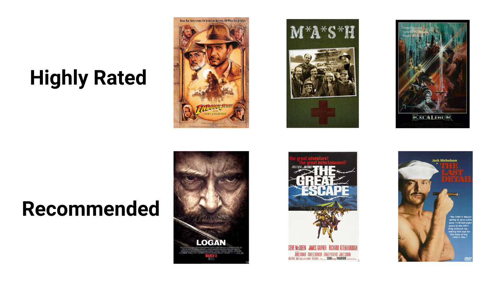
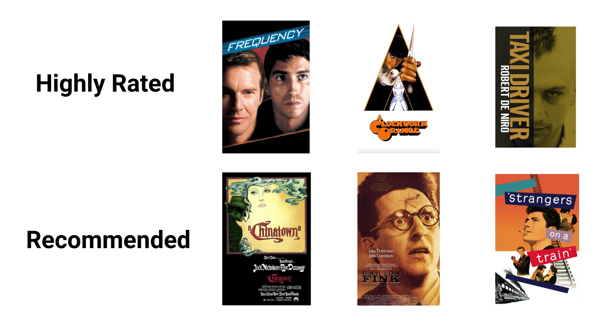

# Movie Recommendation System


**Authors**:

Anat Jacobson
Stephanie Ciaccia

## Overview

Our team is currently developing a movie recommendation model that utilizes review data obtained from MovieLens. The goal of the model is to provide personalized movie recommendations to users based on their ratings of other movies.

The MovieLens dataset is a well-established resource in the field of recommendation systems, and has been used in various academic studies and machine learning experiments. To tailor the app to individual users, we will design a system for users to provide their own ratings of movies. This will help the app suggest movies that align with their preferences.

## Business Problem

For many movie enthusiasts, it can be a real challenge to find a film to watch when they don't have a specific genre or title in mind. Sifting through endless options online can be a frustrating and time-consuming experience.

To tackle this issue, we're developing a recommendation model that will be rolled out as part of an app. This tool will gather data on the user's previously watched and rated films, and then suggest movies that they haven't seen yet based on predicted ratings.

Our goal is to provide a seamless and personalized movie selection experience, reducing the time and effort required for users to find something they'll enjoy.


## Data

- **Movie Lens** - The data used in our analysis was obtained from [Movie Lens]([http://movielens.org]), which consists of user ratings on movies using a 5-star scale. The dataset was collected between March 29, 1996, and September 24, 2018, and includes ratings from 610 users. In total, the dataset contains 100836 ratings and 3683 tags across 9742 movies.

Files from the dataset inclue `links.csv`, `movies.csv`, `ratings.csv` and `tags.csv`.

User bias did not impact overall ratings too much, as the distribution of ratings did not only favor high and low ratings, which can be common.



## Methods

To create a personalized recommendation system for our dataset, we will use a method called **user-based collaborative filtering**. This approach is based on the idea that people who have similar tastes or preferences in the past will have similar tastes in the future. This means that the model makes recommendations based on other similar user preferences.

To apply user-based collaborative filtering, the model will identify the movies that the user has rated in the past. It will then find other users who have rated those movies similarly to the target user. Once similar users have been found, the model will use their ratings to predict the target user's rating for movies they have not yet seen.

## Results

Root Mean Square Error (RMSE) score was used as the main metric to determine the accuracy of the predictive model. The RMSE measures the difference btween the actual and prediting ratings. The movie ratings are on a scale of 1-5. 

Our best model was built using Singular Value Decomposition (SVD) and achieved an RMSE of 0.85.


- Below are two movie recommendations for two different randomly selected users:



- This recommendation has been filtered on the genre "Thriller":



## Conclusions

Our recommendation model aims to simplify the movie selection process for individuals by providing personalized movie suggestions based on their viewing history and preferences. By predicting expected ratings for movies that users have yet to rate, we hope to encourage more accurate ratings, which will result in even better recommendations.

## Next Steps

To enhance the predicted ratings and improve the overall user experience, we're exploring several directions for further development. These include:

1. Run more grid searches and use different model types to improve the RMSE for the best predictions
2. Add in a additional options to our function to allow the user to get recommended movies for a specific characteristics of a movie as opposed to just the top expected rating movie across any category. For example, as mentioned above perhaps an option for selecting director, production studio, language, year created and others. 
3. Look further into a content based filtering in addition to our collaborative model. 
4. Deploy an app that utizes the recommendation model


## For More Information

See the full analysis in the [Jupyter Notebook](add git link here)

## Repository Structure

```
├── data
├── images
├── .gitignore
├── movie_recommendation_system.ipynb
├── movie_recommendation_system.pdf
├── LICENSE
└── README.md
